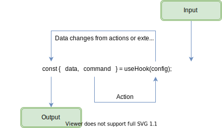

# Clean Functional React

React hooks was released in 2019.  Since then, we've been enamored with their simplicity and composability. Anyone that uses hooks extensively, quickly finds out that the components that consume them, get complicated and messy...real fast. Trying to do hooks in any large scale codebase becomes even more difficult, not to mention, testing is most likely an after thought. My hope with this series is to bring some clarity and structure to our custom react hooks and the components that use them.  The end goal is that our hooks are clean, organized, understandable, and dare I say testable. 😲

## Table of Contents

- [Clean Functional React](#clean-functional-react)
  - [Table of Contents](#table-of-contents)
    - [Reactive Data Flow Pattern](#reactive-data-flow-pattern)
      - [Clear Boundaries](#clear-boundaries)
      - [CommandQuery Separation](#commandquery-separation)
    - [Anti-Patterns](#anti-patterns)
    - [Testability](#testability)

### Reactive Data Flow Pattern



- Properties returned from a hook should either be a data field or a command/action field.  It either gets something or does something. It should never be both. Further more, actions should never be async functions.  Waiting on the async operation should occur inside of the hook, not in the consumer of the hook.

#### Clear Boundaries

```markdown
TODO
```

#### CommandQuery Separation

```markdown
TODO
```

### Anti-Patterns

- Avoid callbacks. Many times you do not need a callback, since the hook will trigger a re-render anytime the data has change. It is in a sense the callback.

- If you must use a callback, aim to have the hook take a callback, but return void.  This will avoid multiple data change observers

### Testability

```markdown
TODO
```
