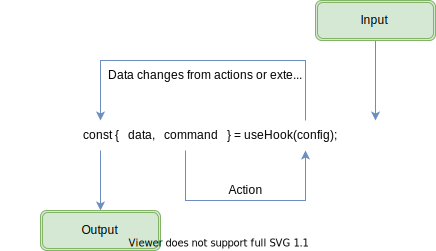

# Clean Functional React

React hooks were first introduced in October 2018 and released with React v16.8.  Since then, we've been enamored with their simplicity and composability. Anyone that uses hooks extensively, quickly finds out that the components that consume them, get complicated and messy...real fast. Trying to do hooks in any large scale codebase becomes even more difficult, not to mention, testing is most likely an after thought. My hope, is to bring some clarity and structure to our custom react hooks and the components that use them.  The end goal is that our hooks are clean, organized, understandable, and dare I say testable. 😲

- [Clean Functional React](#clean-functional-react)
  - [Reactive Data Flow Pattern](#reactive-data-flow-pattern)
  - [Guidelines](#guidelines)
  - [Testability](#testability)
    - [Testing Components](#testing-components)
  - [Further Reading](#further-reading)

## Reactive Data Flow Pattern

The **Reactive Data Flow** pattern draws direct inspiration from the [Command Query Separation Principle](https://en.wikipedia.org/wiki/Command%E2%80%93query_separation) (CQS)



## Guidelines

- ✅ Good hooks are easy to understand, easy to maintian and easy to test.

- ✅ Limit your hook parameters.  Aim to keep them as small and few as possible.

  _A parameter is a dependency which means there are more reasons to update._

- ✅ Prefer properties that are either data fields or commands.

- ✅ Prefer data property fields over methods.

- ✅ Prefer fire-and-forget commands over promises.

  It's common to want to use a promise or callback that returns data when doing something such as updating or loading data. If the result is needed it is better to return any data back through the properties of the hook.

  _Components that consume hooks like this are easier to read and do a better job at separating concerns.  The component is only concerned with displaying the data returned from the hook rather than also handling state and data control logic. It is also much easier to test both the component and the hook._

    ```typescriptreact
    const Component = (props: ComponentProps) => {
        const { id } = props;
        const { value, error, loading, load } = useSomeHook({ id });

        return (
            <div>
                <button onClick={load}>Load</button>
                <div>Value: {value}</div>
                <div>Loading: {loading}</div>
                <div>Error: {error}</div>
            </div>
        );
    }
    ```

- ❌ Avoid async functions that return data.

  _The example below is not only displaying the returned data, but also handling state and data flow logic. This should be avoided inmost situations._

    ```typescriptreact
    const Component = (props: ComponentProps) => {
        const { id } = props;
        const [ error, setError ] = useState();
        const [ loading, setLoading ] = useState();
        const [ value, setValue ] = useState();
        const { getValue } = useSomeHook({ id });

        const load = useCallback(async () => {
            setLoading(true);

            try {
                const value = await getValue();
                setState(value);
            } catch (error) {
                setError(error);
            }

            setLoading(false);
        }, [getValue]);

        return (
            <div>
                <button onClick={load}>Load</button>
                <div>Value: {value}</div>
                <div>Loading: {loading}</div>
                <div>Error: {error}</div>
            </div>
        );
    }
    ```

## Testability

Following the react data flow pattern makes testing much simpler to do.  Here are a few examples of how to do it:

### Testing Components

Mock the results of the hook and concentrate on the rendering portion of the component

```typescriptreact
test("renders", () => {
    // Arrange
    jest.spyOn(useGoodSearch, "default").mockReturnValue({
        hasNext: false,
        hasPrevious: true,
        loadNext: jest.fn(),
        loadPrevious: jest.fn(),
        results: undefined,
        search: jest.fn(),
        searching: false,
    });

    // Act
    const { getByTestId } = renderWithRouter(<App />, { route: "/good" });

    // Assert
    expect(getByTestId("artist-search")).toBeTruthy();
});
```

## Further Reading

- [Built-In React Hooks](./docs/built-in-react-hooks.md)